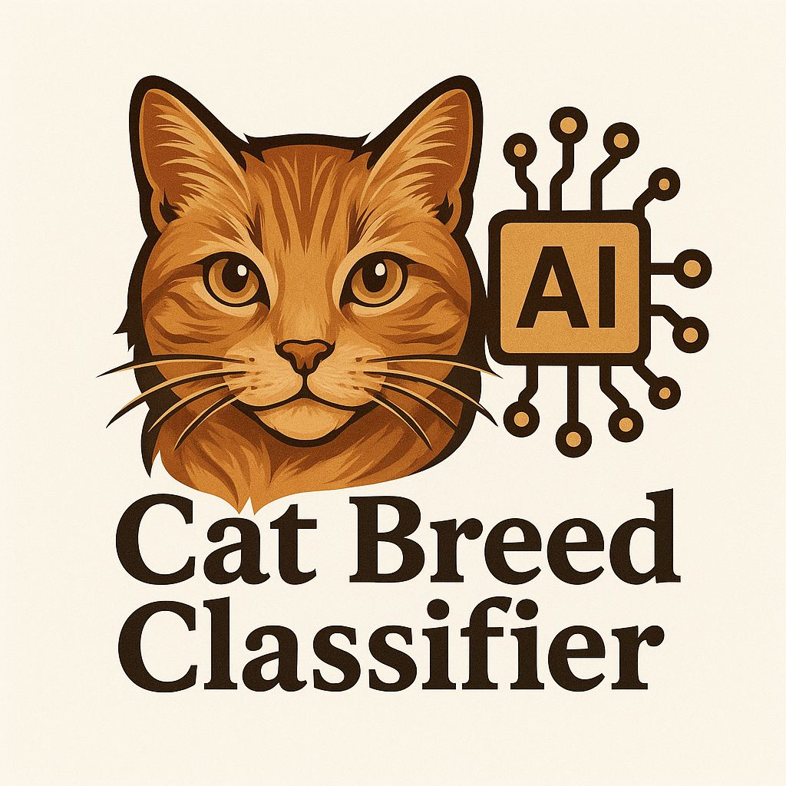

# Cat Breeds Classifier

## Project description
This project aims to classify cat breeds based on their characteristics, using __*neural networks*__.

## Objective of the project
It is a training project to complete the course on machine and deep learning at Mutah University.

## Data used
__Tabular data__ for the characteristics of 10 cat breeds. This is semi-realistic data that was manually collected through ChatGPT's description of the characteristics of these breeds.

Example of data used :

|Breeds |Weight |Length |Fur_length	|Fur_type |Fur_color |Eye_color |Age |Sleep_hours
|:--- |:---: |:---: |:---: |:---: |:---: |:---: |:---: |---:
|Maine Coon |6.7 |51 |long |heavy |brown |copper |12 |14
|Siamese |5.4 |31 |short |soft |creamy |blue |12 |15
|Manx |3.5 |30 |short/medium |soft |red |blue |15 |15

1412 rows × 9 columns

## Characteristics used in prediction

- Breeds
- Weight
- Length
- Fur Length
- Fur Type
- Fur Color
- Eye Color
- Age
- Sleep Hours

## Classified cat breeds

1. Siamese
2. Persian
3. Abyssinian
4. Egyption Mau
5. Turkish Angora
6. Maine Coon
7. Norwegian Forest Cat
8. Manx
9. Japanese Bobtail
10. British Shorthair

## Work stages

1. Data collection
2. Data analysis
3. Data cleaning and transformation
4. Model building (neural networks)
5. Model evaluation
6. Building a user interface

## Results

|||
|:--- |:---:|
|Accuracy | 100% |
|Recall | 1.0 |
|Precision | 1.0 |
|F1-score | 1.0 |
|Confusion Matrix | No data confusion |

## User interface

Enter your cat's information and you will get a breed.

## Download the model and the processors

In order to run the model, download the following files and place them in the following paths :

- [best_model.pt](https://drive.google.com/file/d/1Pyj1RslSIVjpzDAXMwfR0XypPvvolOaN/view?usp=drive_link) -> "models/best_model.pt"
- [scaler.pkl](https://drive.google.com/file/d/1swz1NJmfQaaInQXAXWtQvlMVaA1Ic-Kz/view?usp=drive_link) -> "artifacts/scaler.pkl"
- [dummies_columns.pkl](https://drive.google.com/file/d/1eW3iQX07ZVU25IjxTBv8PJ_1YsJ3epL-/view?usp=drive_link) -> "dummies_columns.pkl"

## Operation method

pip install -r requirements.txt

python main.py

> Make sure you have the Python version 3.13.5

## Team

- Ayed Amjed Ayed Abu Zaid

## Comments

- The project is for educational purposes only.
- The project was supervised by Dr. Ahmed Tarawneh.
